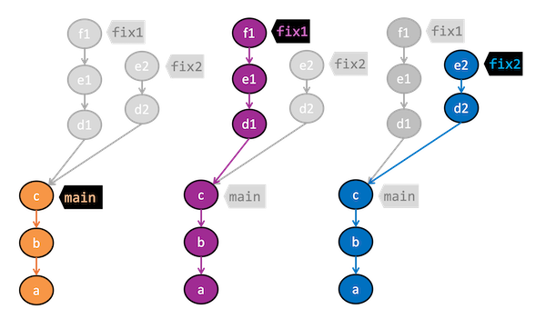
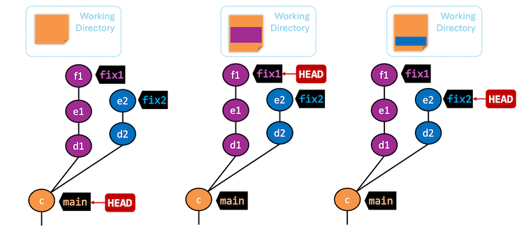



<span id="prereqs"></span>
<span id="outcomes">Able to work in parallel Git branches, in the local repo.</span>

<span id="title">{{ lesson_data.title }} <cv-label name="{{ lesson_data.tour_name }}.{{ lesson_data.lesson_name }}"/></span>

<div class="row align-items-start g-3">
  <div class="col-md-8">
    <div id="body">

**To work in parallel timelines, you can use Git _branches_.**


@[youtube](PGY56U64e3E)

<p/>

**Often, we need to make multiple parallel changes to files in a repository** without one change affecting the others.


**One such situation is when you want to experiment with multiple alternative fixes to a bug in parallel.**

For example, suppose you realized your code has a bug after creating a few commits, as shown in the illustration on the left. Now, you wish to experiment with alternative ways to fix the bug.



If you do that by simply creating more commits, the two fixes will be mixed together and can even interfere with each other. Furthermore, bug fixes you are still experimenting with are now mixed with your main code.

One way to avoid this is to copy-paste the repository to two other folders and use them to experiment with the two bug fixes. However, this is not ideal as you will have three separate repositories to manage, and you will have to manually copy-paste changes between them when you eventually choose which fix to use.

Instead, **in such situations, it is useful if we have a way to maintain multiple parallel timelines in the same repository**.




**Git revision graphs are implemented as <tooltip content="i.e., Directed Acyclic Graphs">DAGs</tooltip>, which means they are already able to maintain such multiple parallel timelines.** For example, Git can maintain two more timelines that {{ show_git_term("diverge") }} from the main timeline (at commit `c`), and let us use each of them to experiment with one of the two bug fixes. This way, you can switch between the timelines to compare the two fixes, and eventually choose which one to keep in the main codebase.




**_Branches_ are the Git feature that allows us to manage those diverged timelines in a practical way.** For one thing, the Git _branches_ feature lets us assign a name to the latest commit in a timeline -- making that timeline easy to refer to.

Therefore, **a {{ show_git_term("branch") }} is a timeline that has been given a name.**
Consequently, **a Git branch is simply a reference ({{ show_git_term("ref") }} for short) -- a label that points to the latest commit of that timeline.** In the example on the left, there are three branches: `main`, `fix1`, and `fix2`.

**The latest commit that branch ref points to is called the {{ show_git_term("tip") }} of the branch.** For example, `c` is the tip of the `main` branch while `f1` is the tip of the `fix1` branch.



**_All_ commits reachable from the branch ref are considered as part of the branch.** Reachability here is based on the 'parent' link each commit has. In the example below, commits `c`, `b`, `a` are on the branch `main` because they are reachable by starting from the ref `main` and traversing the parent links (shown as arrows in the diagram). Similarly, commits `f1`, `e1`, `d1`, `c`, `b`, `a` are on the branch `fix1`, and so on.


<p/>



**The {{ show_git_term("HEAD") }} is a special ref whose job is to point to the branch ref of the branch you are currently on**, also called the {{ show_git_term("current branch") }} or the {{ show_git_term("active branch") }}. In the example on the left, `fix1` is the active branch.

**Git automatically makes the working directory reflect only the commits in the current branch.** This allows us to work on one timeline in isolation without being affected by changes in others.



In the example below, observe how the file in the working directory changes as we change the active branch.


<p/>

Next, let us look at how branches behave as you add commits.


Right after you initialize a repo, Git already has a `HEAD` ref, pointing to a branch ref. **`master` is the default name Git uses for that initial branch**, although you can configure Git to use a different name as the default. **`main` is the more common choice these days** <span class="d-print-none">(and is the default used by Git-Mastery</span>). Let's use that here as well.

**At the start, you already have a branch but without any commits** on it.



The moment you create the first commit, the `main` branch ref immediately points to it, and that commit becomes the tip of the main branch.

<box type="info" seamless>

The first commit of a repo doesn't have a parent commit.
</box>



**When you add a new commit, two things happen:**

1. **First, the new commit uses the commit `HEAD` points to, as its parent.** In this example, the new commit will use the commit `a` as its parent.




2. **Second, the branch ref that `HEAD` points to moves to the new commit.** In this example, the `main` branch ref will move to the new commit `b`.<br>
  The `HEAD` continues to point to the same branch ref, which means the `main` branch is still the _active_ branch.


**That is, new commits go into the branch you are currently on, and the branch ref automatically moves to the new commit**, effectively making the `HEAD` ref point to the new commit as well (via the branch ref).

Next, let us look at how more branches can be added, beyond the initial branch created by Git.


**When you add a new branch, Git adds a branch ref pointing a commit** -- unless you specify another commit, the new branch ref will point to the commit at the tip of the currently active branch.

In the example on the left, the newly-created `fix1` branch ref is pointing to the same commit as the `main` branch ref.



**If you intend your subsequent commits to go into the new branch, you need to make it the active branch** by {{ show_git_term("switching") }} to it. Then, the `HEAD` ref will point to the new branch ref, making it the active branch.

In the example on the left, the `HEAD` ref has moved to point to the `fix1` branch ref, making `fix1` the active branch.



Now, a new commit `d1` has been added, which went onto the `fix1` branch. The `fix1` ref has moved to the new commit, and the `HEAD` ref also point to the new commit via the `fix1` branch ref. The `main` branch ref, however, remains where it is.


<box type="warning" seamless>

Appearance of the revision graph (colors, positioning, orientation etc.) varies based on the Git client you use, and might not match the exact diagrams given above.
</box>
<!-- ================== start: HANDS-ON =========================== -->


{{ hp_number(hop_preparation) }}


Let's create a repo named `sports`, as follows:
```
mkdir sports
cd sports
git init -b main

echo -e "Arnold Palmer\nTiger Woods" > golf.txt
git stage golf.txt
git commit -m "Add golf.txt"

echo -e "Pete Sampras\nRoger Federer\nSerena Williams" > tennis.txt
git stage tennis.txt
git commit -m "Add tennis.txt"

echo -e "Pele\nMaradona" > football.txt
git stage football.txt
git commit -m "Add football.txt"
```


{{ show_hop_prep('hp-create-branch', manual_info=manual) }}

{{ hp_number ('1') }} **Observe that you are on the branch called `main`.**
 <!-- ------ start: Git Tabs --------------->

```bash
git status
```

```bash
On branch main
```




<pic eager src="{{baseUrl}}/lessons/branch/images/onMasterBranch.png" height="120" />
<p/>

{{ show_steps_tabs(cli=cli, sourcetree=sourcetree) }}
<!-- ------ end: Git Tabs -------------------------------->

{{ hp_number ('2') }} **Start a branch named `feature1` and switch to the new branch.**

 <!-- ------ start: Git Tabs --------------->
You can use the `branch` command to create a new branch and the `checkout` command to switch to a specific branch.

```bash{highlight-lines="1['branch'],2['checkout']"}
git branch feature1
git checkout feature1
```

One-step shortcut to create a branch and switch to it at the same time:

```bash{highlight-lines="1['checkout -b']"}
git checkout -b feature1
```

```bash
Switched to a new branch 'feature1'
```


<box type="info" header="The new `switch` command" seamless>

Git recently introduced a [`switch` command](https://git-scm.com/docs/git-switch) that you can use instead of the `checkout` command given above.

To create a new branch and switch to it:
```bash{highlight-lines="2['switch']"}
git branch feature1
git switch feature1
```
One-step shortcut (by using `-c` or `--create` flag):

```bash{highlight-lines="1['switch -c']"}
git switch -c feature1
```
</box>


Click on the `Branch` button on the main menu. In the next dialog, enter the branch name and click `Create Branch`.

<pic eager src="{{baseUrl}}/lessons/branch/images/sourcetreeCreateBranch.png" height="150" />
<p/>

Note how the `feature1` is indicated as the current branch (reason: Sourcetree automatically switches to the new branch when you create a new branch, if the `Checkout New Branch` was selected in the previous dialog).

<pic eager src="{{baseUrl}}/lessons/branch/images/sourcetreeFeature1BranchActive.png" height="150" />
<p/>

{{ show_steps_tabs(cli=cli, sourcetree=sourcetree) }}
<!-- ------ end: Git Tabs -------------------------------->

{{ hp_number ('3') }} **Create some commits in the new branch, as follows.**

* Add a file named `boxing.txt`, stage it, commit it.{texts="['3.1', '3.2', '3.3', '3.4']"}
  ```bash
  echo -e "Muhammad Ali" > boxing.txt
  git stage boxing.txt
  git commit -m "Add boxing.txt"
  ```
* Observe how commits you add while on `feature1` branch will becomes part of that branch.<br>
  Observe how the `feature1` ref and the `HEAD` ref move to the new commit.


 <!-- ------ start: Git Tabs --------------->
As before, you can use the `git log --oneline --decorate` command for this.


* :fab-windows: At times, the `HEAD` ref of the local repo is represented as :fas-dot-circle: in Sourcetree, as illustrated in the screenshot below
  <pic eager src="images/sourcetree_HEAD_dot.png" />.
* :fab-apple: The `HEAD` ref is not shown in the UI if it is already pointing at the active branch.

{{ show_steps_tabs(cli=cli, sourcetree=sourcetree) }}
<!-- ------ end: Git Tabs -------------------------------->

* Add some more texts to `boxing.txt`, stage the changes, and commit it. This commit too will be added to the `feature1` branch.{texts="['3.3']"}
  ```bash
  echo -e "Mike Tyson" >> boxing.txt
  git commit -am "Add Tyson to boxing.txt"
  ```

{{ hp_number ('4') }} **Switch to the `main` branch.** Note how the changes you made in the `feature1` branch are no longer in the working directory.

 <!-- ------ start: Git Tabs --------------->
```bash
git switch main
```


Double-click the `main` branch.

<pic eager src="{{baseUrl}}/lessons/branch/images/sourcetreeMasterBranchSelected.png" height="150" />
<p/>

<box type="info" header="Revisiting `main` vs `origin/main`" seamless>

In the screenshot above, you see a `main` ref and a `origin/main` ref for the same commit. The former identifies the <tooltip content="i.e., the most recent commit on the branch">tip</tooltip> of the local `main` branch while the latter identifies the tip of the `main` branch at the remote repo named `origin`. The fact that both refs point to the same commit means the local `main` branch and its remote counterpart are <tooltip content="neither one has commits the other one doesn't">in sync</tooltip> with each other.
Similarly, `origin/HEAD` ref appearing against the same commit indicates that <tooltip content="`HEAD` ref indicates the currently checked-out branch's latest commit">the `HEAD` ref</tooltip> of the remote repo is pointing to this commit as well.

</box>

{{ show_steps_tabs(cli=cli, sourcetree=sourcetree) }}
<!-- ------ end: Git Tabs -------------------------------->

{{ hp_number ('5') }} **Add a commit to the `main` branch.** Let’s imagine it’s a bug fix.<br>
To keep things simple for the time being, this commit should ==not involve the `boxing.txt` file that you changed in the `feature1` branch==. Of course, this is easily done, as the `boxing.txt` file you added in the `feature1` branch is not even visible when you are in the `main` branch.
```bash
echo -e "Martina Navratilova" >> tennis.txt
git commit -am "Add Martina to tennis.txt"
```
<div id="sports-repo-before-merging">
<mermaid>
gitGraph BT:
    {{ "%%{init: { 'theme': 'default', 'gitGraph': {'mainBranchName': 'main'}} }%%" }}
    commit id: "m1"
    commit id: "m2"
    branch feature1
    commit id: "f1"
    commit id: "[feature1] f2"
    checkout main
    commit id: "[HEAD → main] m3"
    checkout feature1
</mermaid>
</div>

{{ hp_number ('6') }} **Switch between the two branches and see how the working directory changes accordingly.** That is, now you have two parallel timelines that you can freely switch between.

<!-- ===== end: HANDS-ON ============================ -->

**You can also start a branch from an earlier commit**, instead of the latest commit in the current branch. For that, simply check out the commit you wish to start from.

<!-- ================== start: HANDS-ON =========================== -->


{{ hp_number(hop_preparation) }}
{{ show_hop_prep('hp-early-branch', is_continue=1, sandbox_info="the `sports` repo") }}

{{ hp_number(hop_scenario) }} Suppose we want to create a branch containing an alternative version of the content we added in the `feature1` branch.

{{ hp_number(hop_target)}} Create a new branch that starts from the same commit the `feature1` branch started from, as shown below:

<mermaid>
gitGraph BT:
    {{ "%%{init: { 'theme': 'default', 'gitGraph': {'mainBranchName': 'main'}} }%%" }}
    commit id: "m1"
    commit id: "m2"
    branch feature1
    branch feature1-alt
    checkout feature1
    commit id: "f1"
    commit id: "[feature1] f2"
    checkout main
    commit id: "[HEAD → main] m3"
    checkout feature1-alt
    commit id: "[HEAD → feature1-alt] a1"
</mermaid>

<box type="wrong" seamless>

**Avoid this rookie mistake!**{.text-danger}

==Always remember to switch back to the `main` branch before creating a new branch.== If not, your new branch will be created on top of the current branch.
</box>


{{ hp_number('1') }} Switch to the `main` branch.

{{ hp_number('2') }} Checkout the commit at which the `feature1` branch diverged from the `main` branch (e.g. `git checkout HEAD~1`). This will create
<trigger trigger="click" for="modal:branch-detachedHead">a 'detached' `HEAD`</trigger>.

<modal large header="What is a 'detached' `HEAD`? (from [_T4L4. Traversing to a Specific Commit_](../checkout/index.html))" id="modal:branch-detachedHead">
  <include src="../checkout/text.md#detached-head-explanation"/>
</modal>

{{ hp_number('3') }} Create a new branch called `feature1-alt` and switch to it (e.g., `git switch -c feature1-alt`). The `HEAD` will now point to this new branch (i.e., no longer 'detached').



Suppose you are currently on branch `b2` and you want to create a new branch `b3` that starts from `b1`. Normally, you can do that in two steps:

```bash
git switch b1     # switch to the intended base branch first
git switch -c b3  # create the new branch and switch to it
```
This can be done in one shot using the `git switch -c <new-branch> <base-branch>` command:
```
git switch -c b3 b1
```


{{ hp_number('4') }} Add a commit on the new branch. Example:
```bash
echo -e "Venus Williams" >> tennis.txt
git commit -am "Add Venus to tennis.txt"
```

<!-- ===== end: HANDS-ON ============================ -->

</div>

<div id="extras">
{{ show_exercise(exercises.side_track) }}
{{ show_exercise(exercises.branch_previous) }}
</div>
